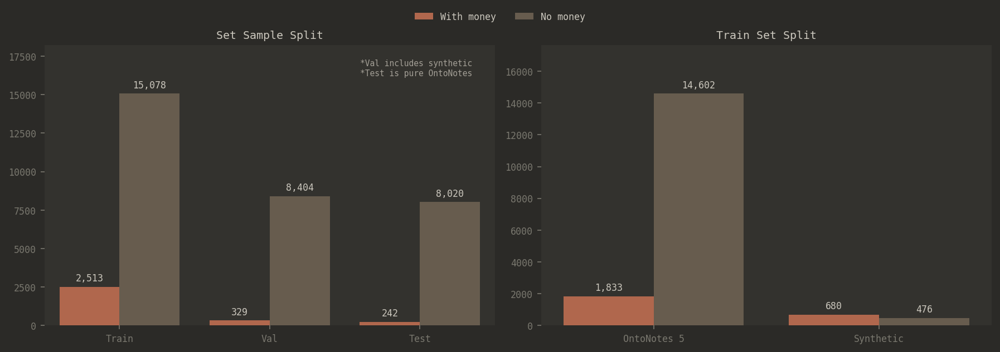

# Proofpoint Money Detector THC

This repo is designed to run on an HTC cluster. System used:

- **OS:** Rocky Linux 8.10
- **CPU:** 2× AMD EPYC 7413 24-Core (48 threads)
- **RAM:** 503 GB
- **GPU:** NVIDIA A100-SXM4-80GB
- **CUDA:** 12.6 (`module load cuda-12.6.1-gcc-12.1.0`)

### File Structure

```
├── main.py                  # Training + evaluation
├── generate_data.py         # Synthetic data generation 
├── environment.yml          # Conda environment spec
├── data/
│   ├── prompts.json         
│   └── synthetic_dataset.json
└── assets/                  
```

### Setup & Running

```bash
module load cuda-12.6.1-gcc-12.1.0
conda env create -f environment.yml
conda activate money-detector
python -m spacy download en_core_web_lg -q
```

Generate synthetic data:

```bash
python generate_data.py
```

Train and evaluate the model:

```bash
python main.py
```

Run evaluation only (loads saved model from `money_detector_final/`):

```bash
python main.py --eval-only
```

## Overview

The task was to build a money detector engine that could quickly and accurately detect money amounts in text. Money amounts could appear in various forms with different currencies. 

Here’s the solution: https://colab.research.google.com/drive/1lqrwZmYdZjv8WukEzb9dAJXUC_bmFg0y?usp=sharing

## Research and Approach

My first instinct given the unfamiliarity of the problem was to explore current best practices for solving it. The first thing I stumbled across was Named Entity Recognition (NER) and the various models and libraries built for this task, like [Microsoft's Presidio](https://microsoft.github.io/presidio/). Using Claude, I found recent literature in the space and went through it to better understand how general solutions to such problems look.

From this research, it seemed like lightweight statistical models like [spaCy](https://huggingface.co/docs/hub/spacy) and transformer-based models like [BERT](https://huggingface.co/docs/transformers/en/model_doc/bert) and [DeBERTa](https://huggingface.co/docs/transformers/en/model_doc/deberta) were common approaches [1][2]. The literature showed that transformer-based models significantly outperform traditional approaches - fine-tuned BERT models can achieve higher F1-scores, outperforming CRF-based approaches as well [2]. DeBERTa specifically has shown strong performance for PII detection tasks, achieving higher precision with a smaller gap between recall compared to zero-shot methods [3].

I chose to go with the transformer approach using [DeBERTa-v3-base](https://huggingface.co/microsoft/deberta-v3-base) and compared it against the [spaCy’s en_core_web_lg](https://huggingface.co/spacy/en_core_web_lg) model in my final solution.

## Dataset Selection and Challenges

### What’s already available

Given that the problem was not a general NER problem but rather focused specifically on money, I tried to find datasets that would sufficiently cover the domain. I came across datasets like [FiNER-ORD](https://huggingface.co/datasets/gtfintechlab/finer-ord) [4] and [OntoNotes 5](https://huggingface.co/datasets/tner/ontonotes5). The main issue was that the money domain is not very popular, and many of these datasets focused on other domains like legal, medical, or general financial entities (PER, LOC, ORG) rather than monetary values.

So I decided to take OntoNotes 5 as a starting point. OntoNotes 5 contains MONEY as one of its 18 entity types (tag indices 16 for B-MONEY and 17 for I-MONEY), making it a suitable foundation. However, the money-containing examples are sparse relative to the total dataset size.

### Synthetic Data

To enrich the dataset further, I used a synthetic data generation approach inspired by the SPY paper [3]. The SPY methodology demonstrates that LLM-generated synthetic data with placeholder entities, later replaced by Faker-generated values, can create effective training data while maintaining control over entity distribution. My pipeline consisted of four stages:

**Stage 1 - Placeholder Generation:** Using `Qwen2.5-7B-Instruct` through [vllm](https://vllm.ai/), I generated sentences containing `<MONEY>` placeholders across various domains. The prompts were designed to generate diverse financial contexts where monetary values would naturally appear.

**Stage 2 - Distractor Enrichment:** The generated sentences were then enriched by adding distractor numbers. This step was important for teaching the model to distinguish between actual money amounts and other numerical values (like dates, quantities, percentages, etc.). Similar to the SPY pipeline's iterative approach for increasing entity density [3], this stage helped create more challenging training examples.

**Stage 3 - Faker Replacement:** The `<MONEY>` placeholders were replaced with realistic-looking money strings using the [Faker library](https://faker.readthedocs.io/en/master/). This included diverse formats such as - price tags (`$9,200`), currency codes (`EUR 3,500.00`), post-currency formats (`4,728,554 PLN`), abbreviations (`$5.2M`) and written amounts (`3 million dollars`). 

The character-level spans were recorded during replacement, enabling BIO tagging for the training data.

**Stage 4 - Hard Negatives:** I generated hard negative examples - sentences that contain numbers but no actual money amounts. These include things like dates, phone numbers, quantities, percentages, and other numerical contexts that could be confused with money. 

### Final Dataset Distribution



**Set Sample Split (Left Chart):**

- **Training Set:** 17,591 total samples (2,513 with money, 15,078 without money)
- **Validation Set:** 8,733 total samples (329 with money, 8,404 without money) - includes synthetic data
- **Test Set:** 8,262 total samples (242 with money, 8,020 without money) - pure OntoNotes data

**Training Set Composition (Right Chart):**

- **OntoNotes 5:** 1,833 positive samples, 14,602 negative samples
- **Synthetic:** 680 positive samples, 476 negative samples

The test set was kept as pure OntoNotes data to provide an unbiased evaluation. The validation set includes synthetic data to help the model generalize across both real and generated text patterns. I targeted approximately a 14% positive rate in the training data to balance the class imbalance while still providing sufficient negative examples for the model to learn from.

## Training

The model was trained on Google Colab using an NVIDIA A100 GPU (80GB variant). Total training time was ~21 minutes for 5 epochs (5,500 training steps). To keep the solution simple, I focused on fine-tuning a DeBERTa-v3-base model for token classification. Here’s the hyperparameters that were used:

| Parameter | Value |
| --- | --- |
| Base Model | microsoft/deberta-v3-base |
| Learning Rate | 2e-5 |
| Batch Size | 8 (with gradient accumulation steps of 2) |
| Epochs | 5 |
| Warmup Steps | 550 |
| Weight Decay | 0.02 |
| Max Sequence Length | 256 |
| Optimizer | AdamW (beta1=0.9, beta2=0.999, epsilon=1e-6) |
| Max Gradient Norm | 1.0 |
| Early Stopping Patience | 3 epochs (threshold: 0.005) |

The model was evaluated using entity-level metrics (precision, recall, F1) computed with the [seqeval library](https://pypi.org/project/seqeval/), which properly handles BIO tagging. I used a `DataCollatorForTokenClassification` with dynamic padding to the longest sequence in each batch for efficiency.

Training converged after 5 epochs with the following progression:

| Epoch | Training Loss | Validation Loss | F1 | Precision | Recall |
| --- | --- | --- | --- | --- | --- |
| 1 | 0.009500 | 0.002508 | 0.864346 | 0.805369 | 0.932642 |
| 2 | 0.006300 | **0.000927** | 0.906091 | 0.888060 | 0.924870 |
| 3 | 0.002100 | 0.000987 | 0.920716 | 0.909091 | 0.932642 |
| 4 | 0.003100 | 0.000993 | **0.939198** | **0.937984** | 0.940415 |
| 5 | **0.001000** | 0.001046 | 0.938144 | 0.933333 | **0.943005** |

## Evaluation

I tested both the fine-tuned `DeBERTa` model and spaCy's `en_core_web_lg` head-to-head on the provided examples from the take-home challenge. I deliberately excluded these examples from the training set to genuinely gauge the model's performance on unseen data patterns.

The qualitative comparison showed both models correctly identifying straightforward cases like `$9,200` and `$2,450`, but the DeBERTa model showed better handling of edge cases like multi-currency formats and ambiguous contexts.


On the held-out OntoNotes test set:

| Model | Precision | Recall | F1 |
| --- | --- | --- | --- |
| DeBERTaV3 (Fine-tuned) | **0.897** | **0.909** | **0.903** |
| spaCy (en_core_web_lg) | 0.871 | 0.863 | 0.867 |

The fine-tuned DeBERTa model outperforms spaCy by approximately 3.6 F1 points. This aligns with literature findings that domain-specific fine-tuning of transformer models provides meaningful improvements over general-purpose NER systems [1][2]. 

## Improvements

1. **Larger Models:** Using [DeBERTa-large](https://huggingface.co/microsoft/deberta-v3-large) would likely improve performance. The tradeoff is increased inference latency and compute requirements.
2. **CRF Layer:** Adding a [Conditional Random Field (CRF) layer](https://docs.pytorch.org/tutorials/beginner/nlp/advanced_tutorial.html) on top of the transformer could improve performance by modeling label dependencies. Research shows BERT-CRF hybrids achieve 93.8% F1 compared to 92.3% for BERT-base alone, as the CRF layer ensures predictions satisfy sequence constraints like "I-MONEY cannot follow O" [2].
3. **Domain-Specific Pre-training:** Continued pre-training on financial text could improve the model's understanding of financial terminology and contexts. 
4. **Hybrid Methods:** Combining the transformer model with rule-based patterns for well-defined formats (like ISO currency codes) could improve precision on standard formats while also leveraging transformer architecture’s effectiveness.

## References

[1] Hybrid Rule-Based and NLP Approach for PII Detection in Financial Documents. Scientific Reports, Nature Portfolio, 2025. https://doi.org/10.1038/s41598-025-04971-9

[2] Nayak, S. "Named Entity Recognition for Payment Data Using NLP." [arXiv:2602.14009](https://arxiv.org/pdf/2602.14009), February 2026.

[3] Savkin, M., Ionov, T., & Konovalov, V. "SPY: Enhancing Privacy with Synthetic PII Detection Dataset." Proceedings of NAACL 2025 Student Research Workshop, pages 236-246. https://aclanthology.org/2025.naacl-srw.23/

[4] Shah, A., Gullapalli, A., Vithani, R., Galarnyk, M., & Chava, S. "FiNER-ORD: Financial Named Entity Recognition Open Research Dataset." [arXiv:2302.11157,](https://arxiv.org/pdf/2302.11157) Georgia Institute of Technology, 2024.